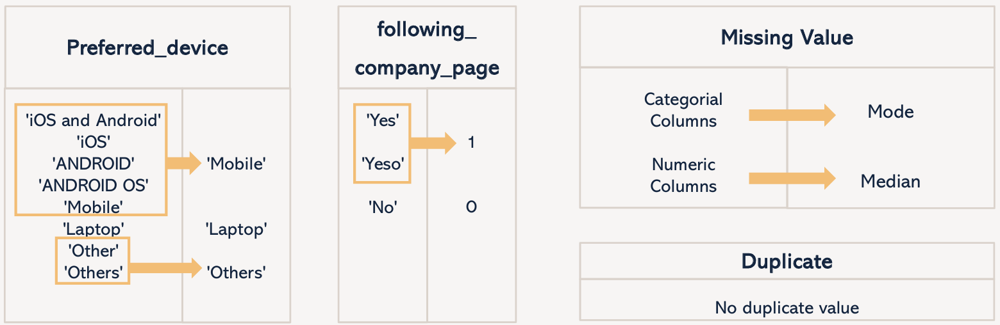
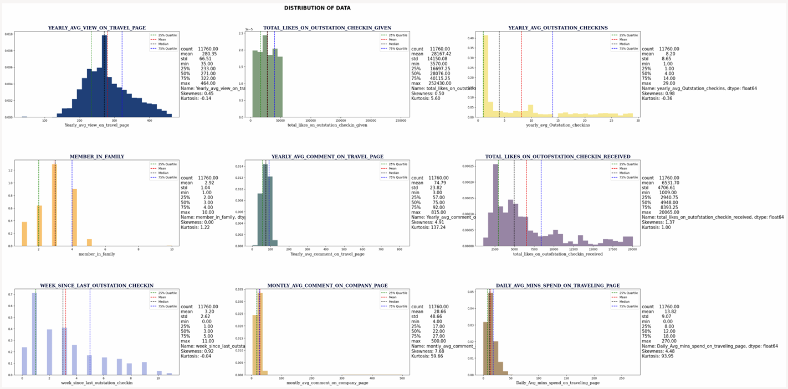
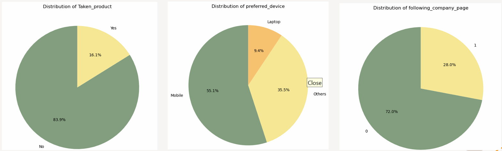
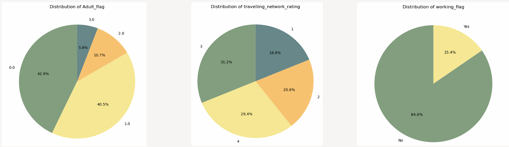
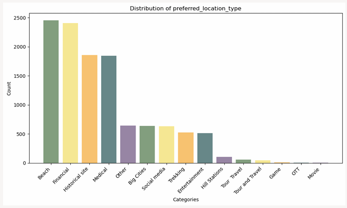
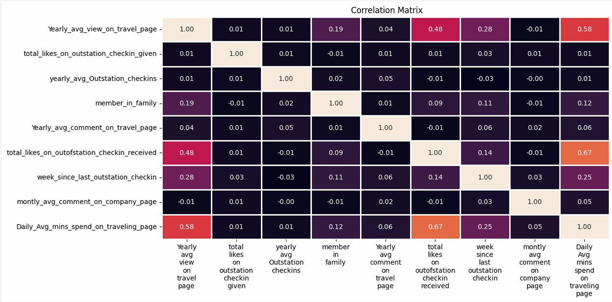
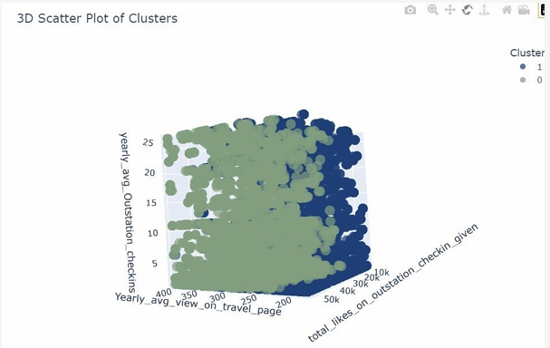
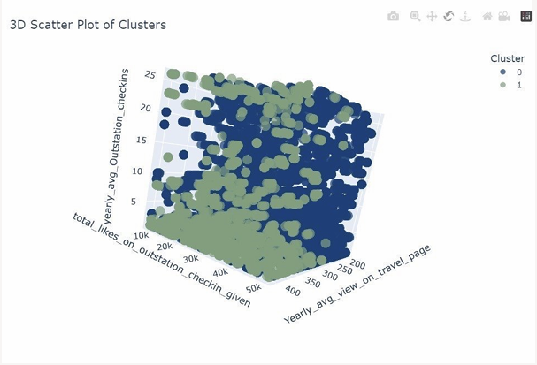

# Tourism-Website-Analysis
# 📌 Project Background 

This project's objective is to help an online tourism website implement a targeted marketing 
strategy that leverages digital and social behavior data to deliver personalized advertisements to 
potential customers. This strategic shift from traditional broad outreach to a more precise digital 
approach aims to optimize marketing efforts, enhance customer engagement, and drive sales 
conversions. The project utilizes advanced analytics techniques, 
including machine learning algorithm K-means clustering. These methodologies enable the 
identification of patterns, trends, and correlations within the data, facilitating the creation of 
predictive models that accurately forecast user behavior and preferences. 

This project uses the datasets [dataset](https://www.kaggle.com/code/ddosad/tourism-website-engagement-eda/notebook) from Kaggle.

<i>In collaboration with Rita Nie, Ey Jin Shain, Kai Wen Lai, Koustubh Sharma.</i>  

# 📊 Data Pre-Processing  
1. Mapping and Replacing 
2. Deal with data type 
3. Missing values and Duplicate values treatment
    
       
    
   
# 🧽 Data Visualizations
1. Distribution of data:
    
       
    
- Skewness: The data displays varying degrees of skewness, indicating the asymmetry in 
distribution, and kurtosis, reflecting the tails' thickness. For instance, outstation check-ins and 
likes received have notable skewness and higher kurtosis, suggesting potential concentration in 
certain ranges. 
- Outliers: While most features do not show extreme outliers, some exhibit variability, 
particularly in outstation check-ins, likes received, and family size.  
- User Interaction Insights: Users commonly engage in commenting on travel and company 
pages, with noticeable variability in the number of likes given and received. 

2. Outliers Treatment:
    
       
    
We applied outlier treatment to the dataset by capping values below the 5th percentile and above 
the 95th percentile of each numerical feature. This approach ensures that extreme values, which 
could potentially skew the analysis or modeling, are brought within a reasonable range. By doing 
so, we aim to improve the robustness and reliability of our data analysis results.

3. Categorical Variables Visualization:
    
       
    
    
       
    
    
       
    
- Device Preference: The analysis revealed that a significant majority of users (55.1%) 
prefer mobile devices for accessing the tourism website. This highlights the importance of 
prioritizing mobile optimization across all digital content, including advertisements, the 
website interface, and mobile applications. Given the prevalence of mobile usage, investing 
in mobile-friendly design and functionality can enhance user experience and engagement, 
driving conversions and sales. 
- Enhancing Engagement: Another noteworthy finding is that most users (71.93%) do not 
follow the company page on the social networking platform. This indicates a potential gap 
in user engagement and presents an opportunity for improvement. To address this, 
strategies should be devised to increase company page followers by providing valuable and 
relevant content. Engaging users through interactive posts, surveys, and promotions can 
foster a sense of community and loyalty, thereby increasing user engagement and brand 
affinity. 
- Understanding Non-Working Majority: The analysis also revealed that a large 
proportion of users (84.62%) are classified as non-working individuals. This demographic 
segment may have unique needs and preferences when it comes to travel-related products 
and services. Tailoring marketing strategies to cater to the non-working majority could 
involve offering flexible travel packages, discounts during off-peak hours, or special 
promotions targeting leisure travelers. By understanding and addressing the needs of this 
user segment, marketers can effectively capitalize on opportunities to drive sales and 
conversions. 
- Addressing Travelling Network Ratings: The distribution of travelling network ratings, 
particularly with a significant percentage at '3' (31.23%) and '4' (29.38%), underscores the 
importance of addressing user feedback and satisfaction. Implementing improvements to 
enhance overall satisfaction and provide a positive user experience can positively impact 
user retention and loyalty. This may involve optimizing website functionality, improving 
customer support services, or introducing new features based on user feedback. By 
prioritizing user satisfaction, businesses can foster long-term relationships with customers 
and drive repeat business. 
- Demographic Tailoring for User Segments: The analysis also revealed diverse 
distribution in the Adult Flag category, with significant proportions in '0.0' (42.92%) and 
'1.0' (40.55%). This suggests varying preferences and needs among different age groups. 
Tailoring services and promotions based on user age groups can lead to more effective and 
targeted marketing efforts. For example, offering age-specific discounts, customized travel 
packages, or targeted advertising campaigns can resonate more effectively with different 
demographic segments. By understanding the unique characteristics of each user segment, 
businesses can personalize their marketing strategies and drive higher engagement and 
conversions. 
- Segmentation of Customers: The segmentation conducted using K Means clustering 
yields two customer clusters. These groups, informed by exploratory data analysis (EDA) 
insights and organizational objectives, offer targeted marketing opportunities. By aligning 
marketing strategies with customer characteristics and business goals, companies can tailor 
campaigns to address specific needs and preferences within each segment. This approach 
optimizes resource allocation and enhances customer engagement, driving sales and 
achieving strategic objectives in the dynamic tourism industry landscape.
 
4. Correlation Heatmap:
    
       
       
- Engagement Patterns: 
Users who spend more time viewing travel content on the platform also tend to spend 
more time engaging with travel-related activities, as evidenced by the moderate positive 
correlation between yearly average views on the travel page and daily average minutes 
spent on the traveling page (0.58). 
- Social Interaction Impact: 
Social interaction plays a significant role in user engagement, with a strong positive 
correlation (0.67) observed between total likes on out-of-station check-ins received and 
the daily average minutes spent on the traveling page. This indicates that users receiving 
more likes on their check-ins are likely to spend more time on the platform. 
- Content Diversity and Family Dynamics: 
There is a weak positive correlation (0.19) between the yearly average views on the travel 
page and the number of family members, suggesting a slight association between family 
dynamics and engagement with travel content. Additionally, the correlation with weeks 
since the last out-station check-in (0.28) indicates that user engagement might vary based 
on the recency of travel-related activities. 

# 👣 Model Building:
The silhouette score measures how close each sample in one cluster is to the samples in the neighboring 
clusters. Its value ranges from -1 to 1. The higher the silhouette score, the better the model has performed.

1. K-Means Clustering:
    
       
    
In the realm of project model building, K-Means Clustering stands 
out as a robust method for identifying inherent groupings within 
data. The process begins with the StandardScaler, which 
standardizes numeric columns to ensure uniformity across 
different scales. A critical step involves utilizing the Elbow 
Method to ascertain the optimal number of clusters by 
examining the Within-Cluster Sum of Square (WCSS). This metric 
helps in determining the compactness of clusters, with a lower WCSS indicating better clustering. 
Additionally, the Silhouette Score serves as an indispensable tool for measuring the closeness of samples 
between clusters and evaluating the overall quality of the clusters formed. A higher Silhouette Score is 
indicative of better-defined clusters, reflecting a successful application of K-Means Clustering in the model 
building phase.

2. Agglomerative Clustering:
    
       
    
In this project, we explore the application of the Elbow  Method 
to determine the optimal number of clusters for our dataset. By 
evaluating the range from 2 to 11, we aim to identify the point at 
which the within-cluster sum of squares (WCSS) does not 
significantly decrease with each additional cluster, indicating the 
most suitable number of clusters. We also incorporate the 
Silhouette Score, utilizing `silhouette_score` from `sklearn.metrics`, to measure how similar an object is 
to its own cluster compared to other clusters. This metric helps in assessing the separation distance 
between the resulting clusters. A higher silhouette score indicates that the objects are well matched to 
their own cluster and poorly matched to neighboring clusters, thus signifying better cluster quality.

# ☁️ Conclusions
In conclusion, the analysis conducted for the online tourism website project provides valuable 
insights and strategic recommendations to enhance marketing effectiveness and drive business 
growth.  
Through exploratory data analysis (EDA), we gained a comprehensive understanding of customer 
behavior, preferences, and demographics. Key findings highlighted the prevalence of mobile 
device usage among users, underscoring the importance of mobile optimization for digital content. 
The segmentation analysis using K-Means clustering identified two distinct customer clusters 
based on their characteristics and behaviors. Leveraging insights from both EDA and the 
organization's business goals, these clusters offer targeted marketing opportunities. By aligning 
marketing strategies with the preferences and needs of each segment, businesses can optimize 
resource allocation and drive higher engagement and conversion rates. 
In summary, the project's findings underscore the importance of data-driven decision-making and 
targeted marketing strategies in the online tourism industry. By leveraging insights from 
exploratory data analysis and segmentation analysis, businesses can optimize marketing efforts, 
enhance customer engagement, and drive business growth.
